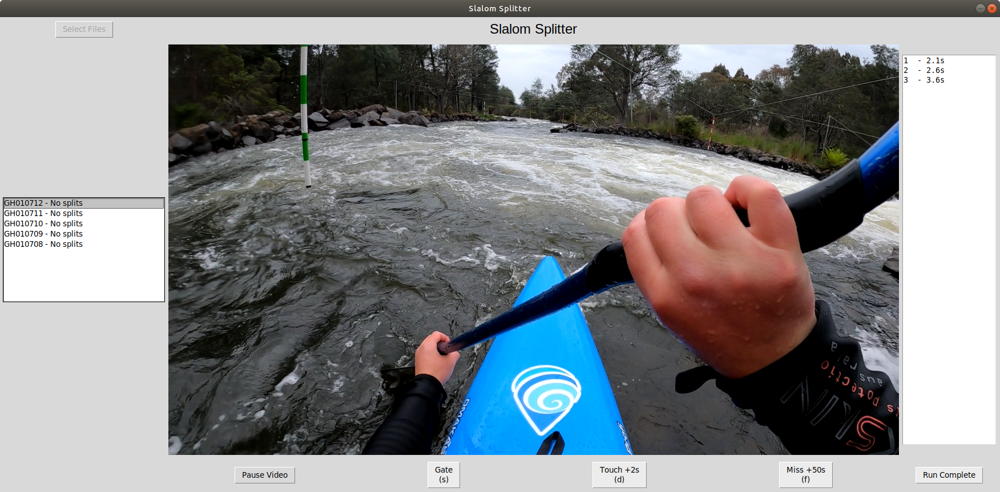
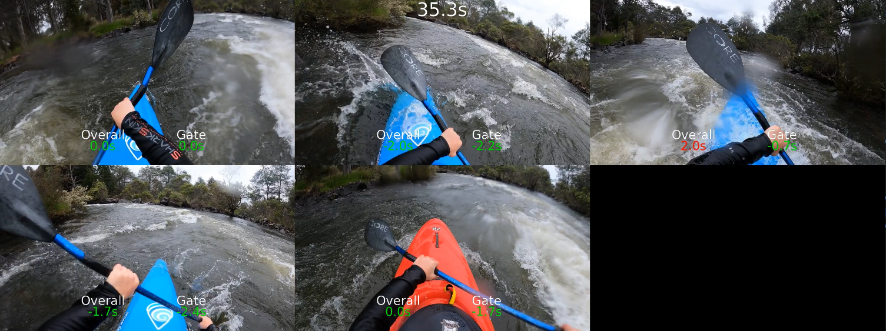

A tool for showing multiple slalom runs in an edited video at the same time.

## Screenshots

**Tool for recroding splits**

**Finished Video**

## Usage/ setup/ installation

First use the splitter to record the gate times, then use the renderer to make a video.

## Dependecies

- linux (not yet tested on windows)
- python packages `pip install -r requirements.txt`
- ffmpeg
- vlc
- imagemagik

## Splitter usage

1. Run `python splitter.py YOUR_FILE.json`. The json file path will be used to store the splits.
1. Select files (top left).
1. Click file in left menu.
1. Click play video.
1. When race starts press s key or click the gate button.
1. As the paddler goes through gates either click the relevant button or press the s, d or f keys.
1. After the last gate you can manually edit the splits in the right menu.
1. To confirm the splits click run complete
1. Click another video and click the play video button. Continue until all vidoes have splits.
1. When all videos are done the data will be saved to the json file passed in as a command line argument.

## Renderer usage

1. This step requires the json file from the splitter.
1. Run `python renderer.py YOUR_FILE.json`
1. Wait a while 5 HD clips * 2.5 mins duration might take 30mins to render.
1. Clip will be written to `clips/output.mp4`

## TODO

- rename listbox item to show what is currently selected
- when run complete is clicked reset pause button state
- update listbox as splits are added
- show peanalties
- Fix play video button after run complete
- Support layouts other than 5 clips
